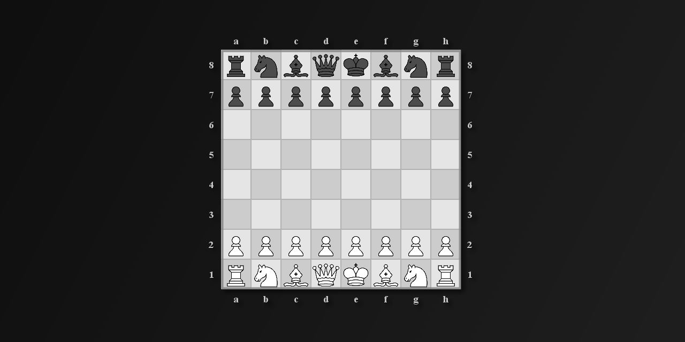

# Universal Chess CLI (ucicli)



Universal Chess CLI is a zero-dependency Java 17 toolkit for driving UCI chess engines, mining tactical puzzles, converting Arena `.record` files, and printing FENs without needing a GUI.

---

## Highlights

- Pure Java 17, no build tooling or external libs; entry point is `application.Main`.
- Talks to any UCI-compatible engine via a TOML description (Stockfish template included).
- Mines single-solution puzzles from random seeds, PGN files, or custom FEN lists; supports Chess960.
- Converts `.record` JSON → `.plain` (and optionally CSV) or `.record` JSON → CSV.
- Pretty-prints any FEN as ASCII for quick inspection.
- Optional dual-head MLP evaluator (scalar + 8x8 grid) in pure Java; load weights from a single binary.

---

## Requirements

- Java 17+ JDK (JRE alone is not enough to build).
- A UCI engine reachable on `PATH` or configured in `config/default.engine.toml`.
- Optional: `config/book.eco.toml` for ECO labels when printing/logging.
- On Debian/Ubuntu, `./install.sh` can install OpenJDK 17 and Stockfish for you.

---

## Build & Run

1) Compile:

```bash
mkdir -p out
javac --release 17 -d out $(find src -name "*.java")
```

2) (Optional) Package a runnable JAR:

```bash
jar --create --file ucicli.jar --main-class application.Main -C out .
java -jar ucicli.jar help
```

3) Run straight from classes:

```bash
java -cp out application.Main help
java -cp out application.Main <command> [options]
```

4) Linux launcher:

```bash
./install.sh    # builds, creates out/, installs /usr/local/bin/ucicli
ucicli help
```

---

## Quick Start

```bash
# Build and run in one go (Linux)
./install.sh
ucicli print --fen "8/8/8/2k5/2Pp4/1P1K4/8/8 w - - 0 1"

# Mine a handful of random puzzles with stock defaults
java -cp out application.Main mine --random-count 50 --output dump/sample.json
```

---

## Commands

- **record-to-plain** — Convert `.record` JSON to `.plain`. Options: `--input|-i <file.record>` (required), `--output|-o <file.plain>` (defaults to input stem), `--filter|-f "<dsl>"`, `--sidelines|--export-all|-a`, `--csv` (emit a CSV next to the plain file), `--csv-output|-c <file.csv>`.
- **record-to-csv** — Convert `.record` JSON straight to CSV. Options: `--input|-i <file.record>` (required), `--output|-o <file.csv>`, `--filter|-f "<dsl>"`.
- **print** — Pretty-print a FEN. Options: `--fen "<FEN...>"` (or pass it positionally), `--verbose|-v` to show stack traces on parse failures.
- **mine** — Drive the engine, gate candidates with filters, and emit JSON lines for puzzles/non-puzzles. Accepts FEN lists (`.txt`), PGN files (`.pgn`), or random seeds; supports Chess960 with `--chess960|-9`.
  - Inputs & outputs: `--input|-i <seeds.txt|games.pgn>` (omit for random), `--output|-o <dir|file>` (directory → timestamped outputs; file-like root ending in `.json`/`.jsonl` → `<stem>.puzzles.json` and `<stem>.nonpuzzles.json`).
  - Engine & limits: `--protocol-path|-P`, `--engine-instances|-e`, `--max-nodes <n>`, `--max-duration <dur>`.
  - Random generation & bounds: `--random-count <n>` (default 100), `--random-infinite`, `--max-waves <n>` (default 100), `--max-frontier <n>` (default 5_000), `--max-total <n>` (default 500_000).
  - Gates (Filter DSL): `--puzzle-quality`, `--puzzle-winning`, `--puzzle-drawing`, `--puzzle-accelerate`.
- **clean** — Remove files under `session/` (logs/cache). Option: `--verbose|-v`.
- **help** — Print CLI usage.

---

## Configuration

Defaults live in `config/`. The CLI loads `config/cli.config.toml` on startup; missing keys fall back to the hard-coded defaults in `application.Config` and any absent file is auto-generated.

- `config/cli.config.toml` (shipped values): protocol path `config/default.engine.toml`, output root `dump/`, engine instances `4`, `max-nodes` `50_000_000`, `max-duration` `1_000_000` ms, plus default filter DSL strings. If the file is missing, a fresh one is created with the internal defaults (1 engine, 100_000_000 nodes, 60_000 ms).
- `config/default.engine.toml`: UCI command templates for your engine—binary path, `setoption` templates (threads, multipv, Chess960), `go` command formats, and optional `setup` commands to run after `uci/isready`.
- `config/book.eco.toml`: Optional ECO dictionary used when printing/logging.

Notes:

- CLI flags always override TOML for a single run.
- `--output` accepts a directory (`dump/`) or a file-like root (`results.json` → `results.puzzles.json`, `results.nonpuzzles.json`).
- Durations accept milliseconds or Java `Duration` strings (`45s`, `2m`, `500ms`).
- Chess960 toggling is driven by `--chess960`/`-9` and the `setChess960` template in the engine protocol file.

---

## Concepts & Gotchas

- Seeds: A FEN list line may hold one FEN (position only) or two FENs; if two, the first is the parent and the second is the position. Extra tokens after two FENs are ignored once both are parsed.
- PGN input: Mainlines and all variations become seeds (parent/child links preserved) so tactical side-branches are explored too.
- Puzzle acceptance: Mining uses an accelerate prefilter, then a quality gate, then a winning/drawing gate combined via `Config.buildPuzzleVerify` (quality AND (win OR draw)).
- Random mining: Without `--input`, seeds are generated randomly; `--chess960` switches the generator and sends the Chess960 toggle defined in your engine protocol TOML.
- Outputs: When `--output` points to a directory, filenames are timestamped and prefixed with `standard-` or `chess960-`; when `--output` looks like a file, sibling `<stem>.puzzles.json` and `<stem>.nonpuzzles.json` are written in that directory.
- Logs: `session/` contains structured logs from `chess.debug.LogService`; `clean` removes files but keeps the directory.

---

## Filter DSL

Filters are compact Boolean programs used by `mine` (quality, winning, drawing, accelerate). Syntax:

- Blocks combine predicates/leaves with `gate=<AND|OR|NOT_AND|NOT_OR|XOR|X_NOT_OR|SAME|NOT_SAME>`.
- `break=<n>` selects which MultiPV line the block inspects (1 = best, 2 = second, etc.).
- `null=<true|false>` and `empty=<true|false>` control return values when data is missing or the block has no predicates.
- Predicates use `<metric><op><value>` with `> >= = <= <`. Metrics: `nodes`, `nps`, `tbhits`, `time` (ms), `depth`, `seldepth`, `multipv`, `hashfull` (0..1000), `eval` (cp or `#-2`), `chances` (`wdl 790 200 10`, `79 20 1`, or `1000/0/0`).
- `leaf[ ... ]` nests another block that is combined with the parent via the parent gate.
- Whitespace is ignored; TOML triple quotes let you split strings across lines.

Example (quality gate from the shipped config):

```txt
gate=AND;null=false;empty=false;
leaf[gate=AND;break=1;nodes>=50000000];
leaf[gate=AND;break=2;null=false;empty=false;nodes>=50000000];
```

---

## Troubleshooting

- Use `--verbose` to print stack traces for `print`, `clean`, and mining failures.
- If a filter expression is invalid, the CLI logs the error and falls back to the default DSL for that gate.
- Ensure your engine binary path in `config/default.engine.toml` (or a copy) exists and is executable; otherwise `mine` will fail when spawning engines.
- When mining appears slow, lower `max-nodes`/`max-duration`, reduce `--engine-instances`, or relax the quality gate thresholds.

---

## Usage Examples

```bash
# Print a FEN
java -cp out application.Main print --fen "rnbqkbnr/pppppppp/8/8/8/8/PPPPPPPP/RNBQKBNR w KQkq - 0 1"

# Convert a record and keep sidelines (+CSV export)
java -cp out application.Main record-to-plain -i data/source.record -o dump/source.plain --sidelines --csv

# Convert record → CSV only
java -cp out application.Main record-to-csv -i data/source.record -o dump/source.csv

# Mine 500 random seeds with higher limits
java -cp out application.Main mine --random-count 500 --engine-instances 8 --max-nodes 75_000_000 --max-duration 90s --output dump/

# Mine Chess960 positions endlessly
java -cp out application.Main mine --chess960 --random-infinite --output dump/chess960.json

# Mine from a FEN text file (one or two FENs per line: first = parent, second = position)
java -cp out application.Main mine --input seeds/tactics.txt --output dump/tactics.json

# Mine from PGN (mainline + variations become seeds)
java -cp out application.Main mine --input seeds/games.pgn --output dump/pgn-derived.json

# Clean session cache/logs
java -cp out application.Main clean
```

---

## MLP Evaluator (optional)

- Place the exported weights at `models/mlp_dual_wide.bin` (generate with `src/chess/nn2/export_weights.py` if needed).
- Load in Java: `var eval = chess.mlp.MlpWeightsLoader.load(Path.of("models/mlp_dual_wide.bin"));`
- Evaluate a position: `var result = eval.evaluate(position);` (`result.scalarEval`, `result.grid64`).
- Feature encoding matches `chess.mlp.FeatureEncoder` (781 inputs: board, castling, en-passant file, side to move).

---

## Outputs & Logs

- Puzzle exports are JSON Lines files with `.json` extensions: `<tag>-<timestamp>.puzzles.json` and `.nonpuzzles.json` when targeting a directory; `<stem>.puzzles.json` and `<stem>.nonpuzzles.json` when targeting a file-like root.
- `dump/` is the default output root; override via config or `--output`.
- `session/` holds logs from `chess.debug.LogService` (`application.log`, etc.); remove them anytime with `clean`.

---

## License

See `LICENSE.txt`.
