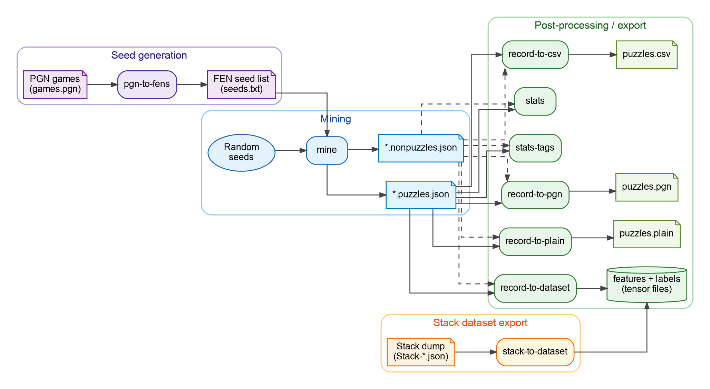
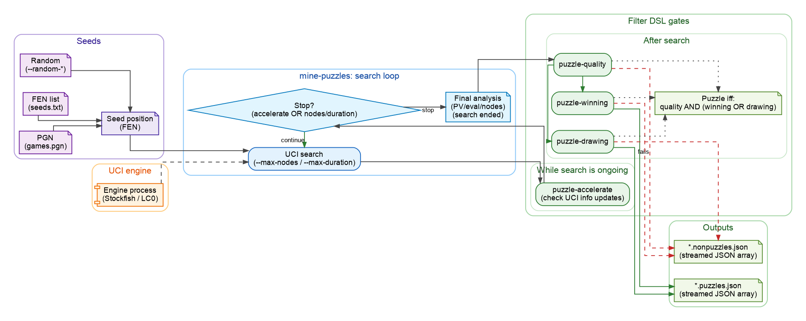

# ChessRTK (crtk) — chess research toolkit

ChessRTK is a reproducible, zero-dependency Java 17 toolkit for chess research: drive UCI engines, mine tactical puzzles, convert/inspect analysis dumps, and export ML-ready datasets for AI experiments and training (currently emitted as tensor files) without needing a GUI.

CLI command: `crtk`

Built for:
- chess researchers / dataset builders / engine experimenters
- high-throughput, scriptable pipelines (CLI-first)

Not a:
- playing app or chess GUI

---

## Pipeline overview



Diagram source: `assets/crtk-pipeline-overview.dot` (render with `dot -Tpng -Gdpi=160 -o assets/crtk-pipeline-overview.png assets/crtk-pipeline-overview.dot`).

---

## Research workflow (copy/paste)

Mine puzzles from a PGN (via FEN seeds) and convert the results to CSV + PGN:

```bash
crtk pgn-to-fens --input games.pgn --output seeds.txt
crtk mine-puzzles --input seeds.txt --output dump/run.json --engine-instances 4 --max-duration 60s
crtk record-to-csv --input dump/run.puzzles.json --output dump/run.puzzles.csv
crtk record-to-pgn --input dump/run.puzzles.json --output dump/run.puzzles.pgn
```

### Mining decision gates



Diagram source: `assets/crtk-mining-gates.dot` (render with `dot -Tpng -Gdpi=100 -o assets/crtk-mining-gates.png assets/crtk-mining-gates.dot`).

Other common primitives:

- Mine random seeds: `crtk mine-puzzles --random-count 200 --output dump/random.json` (or endless with `--random-infinite`)
- Validate movegen: `crtk perft --depth 5`
- Engine probing: `crtk analyze --fen "<FEN>" --max-duration 2s`, `crtk bestmove --fen "<FEN>" --max-duration 200`, `crtk threats --fen "<FEN>" --max-duration 2s`
- Position inspection: `crtk print --fen "<FEN>"`, `crtk display --fen "<FEN>" --special-arrows`, `crtk render --fen "<FEN>" --output dump/pos.png`
- Dataset export: `crtk record-to-dataset --input dump/run.puzzles.json --output training/puzzles`

## Single-position toolbox


Diagram source: `assets/crtk-position-toolbox.dot` (render with `dot -Tpng -Gdpi=160 -o assets/crtk-position-toolbox.png assets/crtk-position-toolbox.dot`).

## Docs (full)

- Start here: `wiki/README.md`
- Commands: `wiki/command-reference.md`
- Examples: `wiki/example-commands.md`
- Config: `wiki/configuration.md`
- Mining: `wiki/mining.md`
- Datasets: `wiki/datasets.md`
- Filter DSL: `wiki/filter-dsl.md`
- AI agents & automation: `wiki/ai-agents.md`

---

## Quickstart

Requirements:
- Java 17+ JDK (needs `javac`)
- A UCI engine on `PATH` (e.g. Stockfish) or configured via `config/*.engine.toml`

Build (no Maven/Gradle):

```bash
mkdir -p out
javac --release 17 -d out $(find src -name "*.java")
```

Run:

```bash
java -cp out application.Main help
java -cp out application.Main <command> [options]
```

Linux convenience installer (Debian/Ubuntu):

```bash
./install.sh
crtk help
```

More: `wiki/build-and-install.md`

---

## What It Does

- `mine-puzzles`: evaluate lots of seeds (random / `.txt` / `.pgn`) and emit puzzles + non-puzzles JSON
- `record-to-plain`, `record-to-csv`, `record-to-pgn`: convert `.record` analysis dumps to `.plain`, CSV, or PGN
- `record-to-dataset`, `stack-to-dataset`: export tensors for AI training (features `(N, 781)`)
- `print`: pretty-print a FEN as ASCII (includes tags)
- `display`: open a small GUI board view (overlays + optional ablation)
- `render`: save a board image to disk (PNG/JPG/BMP)
- `gpu-info`: show LC0 GPU backend availability and device info (CUDA/ROCm/oneAPI)
- `analyze`, `bestmove`: analyze a FEN and extract the best move
- `moves`, `tags`: list legal moves or tags for a FEN
- `stats`, `stats-tags`: summarize dumps or tag distributions
- `perft`: validate move generation at a given depth
- `pgn-to-fens`: extract FEN seeds from PGN files
- `eval`: evaluate a position with LC0 or classical heuristics
- `clean`: remove/clean derived artifacts
- `config`: show/validate resolved configuration

---

## Configuration / Filters / Outputs / Logs

- Configuration: `wiki/configuration.md`
- Mining pipeline: `wiki/mining.md`
- Filter DSL: `wiki/filter-dsl.md`
- Outputs & logs: `wiki/outputs-and-logs.md`
- More examples: `wiki/example-commands.md`

---

## Citing

If you use ChessRTK in research, consider citing the repository and pinning a commit hash/tag for reproducibility.

---

## Optional evaluators

ChessRTK supports two different “LC0” paths:

- LC0 as a UCI engine for mining (usually needs `.pb.gz` weights): see `wiki/lc0.md`
- Built-in Java LC0 evaluator for `eval`/`display`/ablation (uses `models/lc0_744706.bin`): see `wiki/lc0.md` and `models/README.md`

---

## Release (Linux CUDA)

This repo includes an optional CUDA JNI backend under `native/cuda/`.

To build and package a CUDA-enabled Linux x86_64 release artifact:

```bash
scripts/make_release_linux_cuda.sh --version v0.0.0
```

To include `models/` in the release bundle:

```bash
scripts/make_release_linux_cuda.sh --version v0.0.0 --include-models
```

Outputs:
- `dist/crtk-<version>-linux-x86_64-cuda.tar.gz`
- `dist/SHA256SUMS`

---

## Roadmap / ideas

A short list of proposed future subcommands and contributor tooling lives in `wiki/roadmap.md`.

---

## License

See `LICENSE.txt`.
