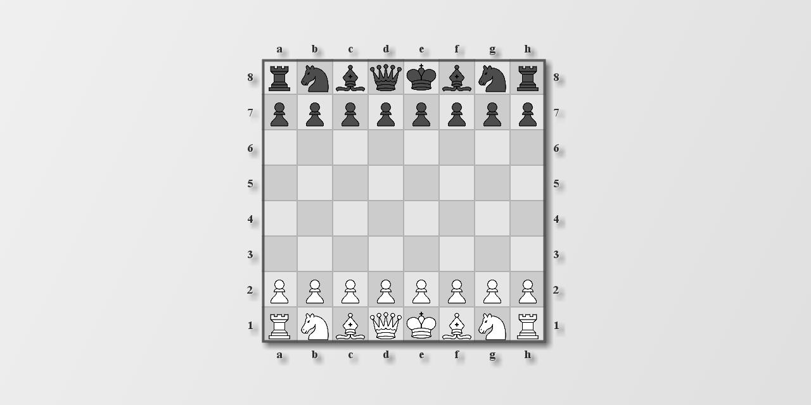

# ChessRTK (crtk) — chess research toolkit



ChessRTK is a reproducible, zero-dependency Java 17 toolkit for chess research: drive UCI engines, mine tactical puzzles, convert/inspect analysis dumps, and export ML-ready datasets for AI experiments and training (currently emitted as tensor files) without needing a GUI.

CLI command: `crtk`

Built for:
- chess researchers / dataset builders / engine experimenters
- high-throughput, scriptable pipelines (CLI-first)

Not a:
- playing app or chess GUI

---

## Research tasks (copy/paste)

### Task 1: Build a seed set (PGN → FEN list)

Extract FENs from a PGN so you can mine reproducibly from a fixed seed list:

```bash
crtk pgn-to-fens --input games.pgn --output seeds.txt
```

### Task 2: Mine puzzles from a seed file

Run the miner on your seed list and write deterministic output filenames:

```bash
crtk mine --input seeds.txt --output dump/run.json --engine-instances 4 --max-duration 60s
# outputs: dump/run.puzzles.json + dump/run.nonpuzzles.json
```

Optionally tighten the “winning puzzle” gate (Filter DSL):

```bash
crtk mine --input seeds.txt --output dump/run.json \
  --puzzle-winning "gate=AND;leaf[eval>=300];leaf[break=2;null=false;eval<=0];"
```

### Task 3: Mine from random positions (finite or endless)

Finite random batch:

```bash
crtk mine --random-count 200 --output dump/random.json
```

Endless stream (stop with Ctrl+C; outputs stay usable on disk):

```bash
crtk mine --random-infinite --output dump/live.json
```

### Task 4: Inspect a position (print / display / render)

Print a FEN as ASCII:

```bash
crtk print --fen "rnbqkbnr/pppppppp/8/8/8/8/PPPPPPPP/RNBQKBNR w KQkq - 0 1"
```

Open a small board window (useful for quick visual sanity checks):

```bash
crtk display --fen "r1bqk2r/ppppbppp/3n4/4R3/8/8/PPPP1PPP/RNBQ1BK1 b kq - 2 8" --special-arrows --arrow e5e1 --legal d6
```

Save an image to disk:

```bash
crtk render --fen "rnbqkbnr/pppppppp/8/8/8/8/PPPPPPPP/RNBQKBNR w KQkq - 0 1" --output dump/pos.png
```

### Task 5: Validate movegen + generate features/tags

Perft from the standard start position:

```bash
crtk perft --depth 5
```

List legal moves or tags for a position:

```bash
crtk moves --fen "rnbqkbnr/pppppppp/8/8/8/8/PPPPPPPP/RNBQKBNR w KQkq - 0 1" --both
crtk tags --fen "r1k5/2p4p/2p5/3p4/1Q4P1/1P3P2/PR3R2/1K5q w - - 1 34"
```

### Task 6: Probe an engine (analyze / bestmove)

```bash
crtk analyze --fen "rnbqkbnr/pppppppp/8/8/8/8/PPPPPPPP/RNBQKBNR w KQkq - 0 1" --max-duration 2s
crtk bestmove --fen "rnbqkbnr/pppppppp/8/8/8/8/PPPPPPPP/RNBQKBNR w KQkq - 0 1" --max-duration 200
```

### Task 7: Summarize + convert mined outputs

Summarize the mined dataset:

```bash
crtk stats --input dump/run.puzzles.json
crtk stats-tags --input dump/run.puzzles.json
```

Convert to other formats for downstream tooling:

```bash
crtk record-to-csv --input dump/run.puzzles.json --output dump/run.puzzles.csv
crtk record-to-pgn --input dump/run.puzzles.json --output dump/run.puzzles.pgn
crtk record-to-plain --input dump/run.puzzles.json --output dump/run.puzzles.plain
```

### Task 8: Export datasets for AI training

```bash
crtk record-to-dataset --input dump/run.puzzles.json --output training/puzzles
# writes: training/puzzles.features.npy + training/puzzles.labels.npy
```

## Pipeline overview

```mermaid
flowchart LR
  PGN[PGN] --> FENS[pgn-to-fens]
  FENLIST[FEN list (.txt)] --> M[mine]
  RAND[Random seeds] --> M
  FENS --> FENLIST

  M --> P[*.puzzles.json]
  M --> N[*.nonpuzzles.json]

  P --> STATS[stats / stats-tags]
  P --> CONV[record-to-plain / record-to-csv / record-to-pgn]
  P --> DS[record-to-dataset]
  N --> STATS
  N --> CONV
  N --> DS

  STACK[Stack-*.json] --> SDS[stack-to-dataset]
  DS --> OUT[(features + labels)]
  SDS --> OUT
```

## Docs (full)

- Start here: `wiki/README.md`
- Commands: `wiki/command-reference.md`
- Examples: `wiki/example-commands.md`
- Config: `wiki/configuration.md`
- Mining: `wiki/mining.md`
- Datasets: `wiki/datasets.md`
- Filter DSL: `wiki/filter-dsl.md`
- AI agents & automation: `wiki/ai-agents.md`

---

## Quickstart

Requirements:
- Java 17+ JDK (needs `javac`)
- A UCI engine on `PATH` (e.g. Stockfish) or configured via `config/*.engine.toml`

Build (no Maven/Gradle):

```bash
mkdir -p out
javac --release 17 -d out $(find src -name "*.java")
```

Run:

```bash
java -cp out application.Main help
java -cp out application.Main <command> [options]
```

Linux convenience installer (Debian/Ubuntu):

```bash
./install.sh
crtk help
```

More: `wiki/build-and-install.md`

---

## What It Does

- `mine`: evaluate lots of seeds (random / `.txt` / `.pgn`) and emit puzzles + non-puzzles JSON
- `record-to-plain`, `record-to-csv`, `record-to-pgn`: convert `.record` analysis dumps to `.plain`, CSV, or PGN
- `record-to-dataset`, `stack-to-dataset`: export tensors for AI training (features `(N, 781)`)
- `print`: pretty-print a FEN as ASCII
- `display`: open a small GUI board view (overlays + optional ablation)
- `render`: save a board image to disk (PNG/JPG/BMP)
- `gpu-info`: show LC0 GPU backend availability and device info (CUDA/ROCm/oneAPI)
- `analyze`, `bestmove`: analyze a FEN and extract the best move
- `moves`, `tags`: list legal moves or tags for a FEN
- `stats`, `stats-tags`: summarize dumps or tag distributions
- `perft`: validate move generation at a given depth
- `pgn-to-fens`: extract FEN seeds from PGN files
- `eval`: evaluate a position with LC0 or classical heuristics
- `clean`: remove/clean derived artifacts
- `config`: show/validate resolved configuration

---

## Configuration / Filters / Outputs / Logs

- Configuration: `wiki/configuration.md`
- Mining pipeline: `wiki/mining.md`
- Filter DSL: `wiki/filter-dsl.md`
- Outputs & logs: `wiki/outputs-and-logs.md`
- More examples: `wiki/example-commands.md`

---

## Citing

If you use ChessRTK in research, consider citing the repository and pinning a commit hash/tag for reproducibility.

---

## Optional evaluators

ChessRTK supports two different “LC0” paths:

- LC0 as a UCI engine for mining (usually needs `.pb.gz` weights): see `wiki/lc0.md`
- Built-in Java LC0 evaluator for `eval`/`display`/ablation (uses `models/lc0_744706.bin`): see `wiki/lc0.md` and `models/README.md`

---

## Release (Linux CUDA)

This repo includes an optional CUDA JNI backend under `native/cuda/`.

To build and package a CUDA-enabled Linux x86_64 release artifact:

```bash
scripts/make_release_linux_cuda.sh --version v0.0.0
```

To include `models/` in the release bundle:

```bash
scripts/make_release_linux_cuda.sh --version v0.0.0 --include-models
```

Outputs:
- `dist/crtk-<version>-linux-x86_64-cuda.tar.gz`
- `dist/SHA256SUMS`

---

## Roadmap / ideas

A short list of proposed future subcommands and contributor tooling lives in `wiki/roadmap.md`.

---

## License

See `LICENSE.txt`.
